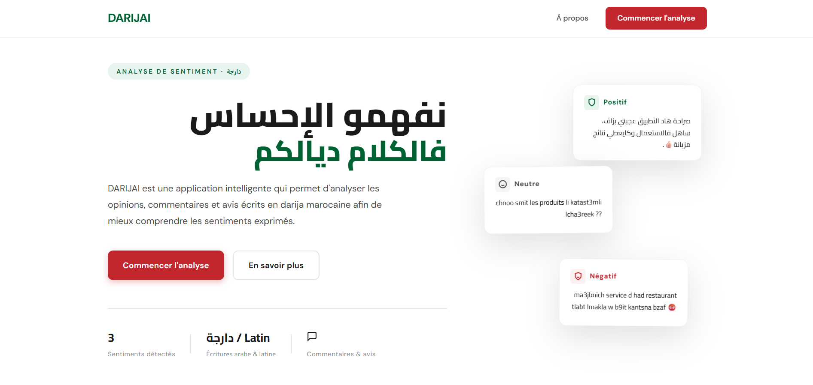
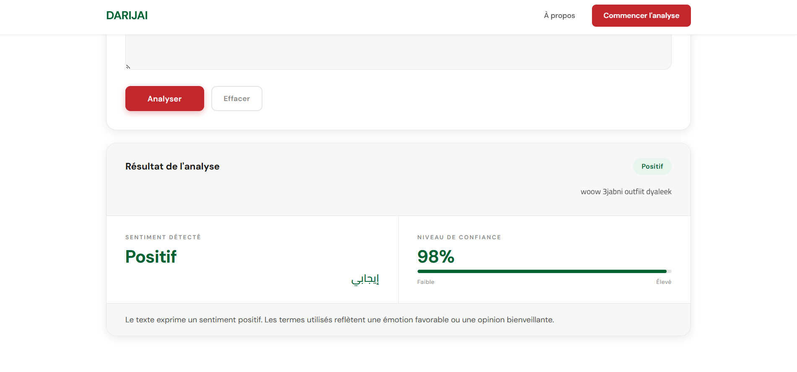
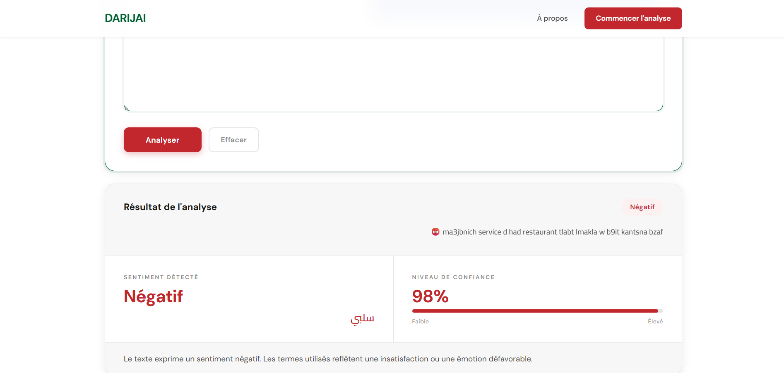
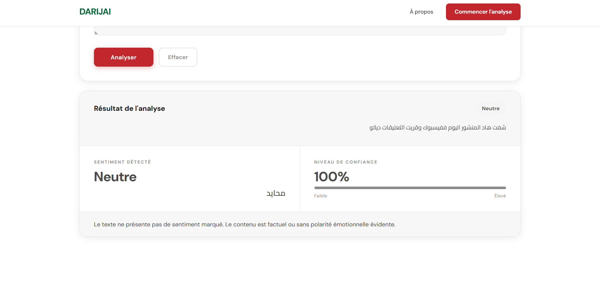

# 🇲🇦 Analyse de Sentiment en Darija Marocain (Deep Learning)
 
Classification de sentiments sur des textes en **darija marocain** (script arabe et arabizi). Le projet compare trois familles de modèles : Machine Learning classique (TF-IDF), Deep Learning (LSTM, BiLSTM, CNN) et Transformers (DarijaBERT, AraBERT).
## 📊 Results :     
